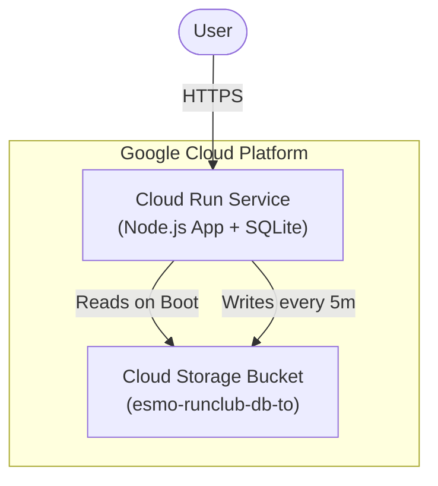

# ESMO Run Club

A running club application for ESMO, built with Node.js.

## Architecture



## Security & Limitations
> [!WARNING]
> **No Authentication**: This application currently uses "honor-system" login. Users enter their name to log in, and there are **no passwords**.
> - **Public Access**: Any user can log in as any other user if they know the name.
> - **Data Privacy**: Do not store sensitive personal information in this version.
> - **Future Work**: Implementing OAuth or Password-based Auth is recommended for v0.2.0.

## Deployment Guide

If you want to deploy this application to your own Google Cloud project, follow these steps.

### Prerequisites
- [Google Cloud SDK](https://cloud.google.com/sdk/docs/install) installed and authenticated.
- A Google Cloud Project with billing enabled.

### 1. Get the Code
```bash
git clone https://github.com/Screamy76/Club_de_Course_ESMO_V2.git
cd Club_de_Course_ESMO_V2
```

### 2. Initial Setup
```bash
# Login to Google Cloud
gcloud auth login

# Set your project ID
export PROJECT_ID="your-project-id"
gcloud config set project $PROJECT_ID

# Enable required services
gcloud services enable run.googleapis.com cloudbuild.googleapis.com artifactregistry.googleapis.com storage.googleapis.com
```

### 3. Infrastructure
Create the Artifact Registry and Storage Bucket.

```bash
# Create Artifact Registry (Toronto)
gcloud artifacts repositories create run-club-repo \
    --repository-format=docker \
    --location=northamerica-northeast1 \
    --description="Docker repository for ESMO Run Club"

# Create Bucket for DB Persistence
export BUCKET_NAME="esmo-runclub-db-$PROJECT_ID"
gcloud storage buckets create gs://$BUCKET_NAME --location=northamerica-northeast1
```

### 4. Deploy
Build the container and deploy to Cloud Run.

```bash
# Build and Push Container
gcloud builds submit --tag northamerica-northeast1-docker.pkg.dev/$PROJECT_ID/run-club-repo/app:latest .

# Deploy to Cloud Run
gcloud run deploy esmo-runclub \
  --image northamerica-northeast1-docker.pkg.dev/$PROJECT_ID/run-club-repo/app:latest \
  --region northamerica-northeast1 \
  --allow-unauthenticated \
  --set-env-vars=DB_BUCKET_NAME=$BUCKET_NAME
```
